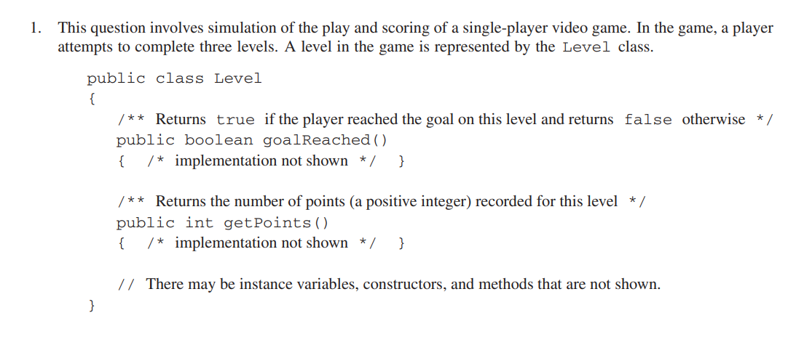
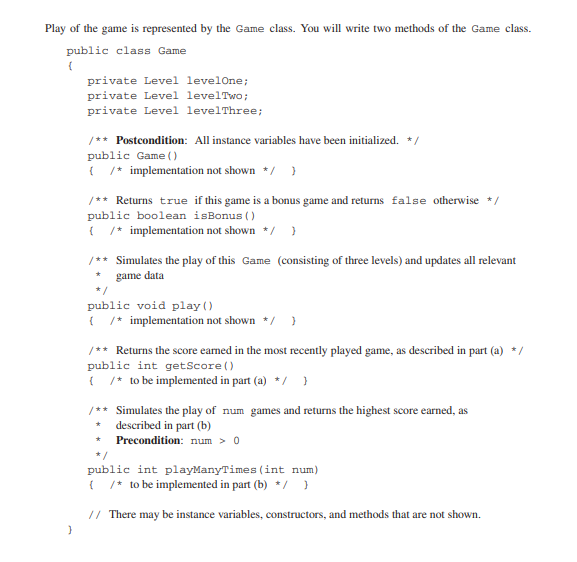
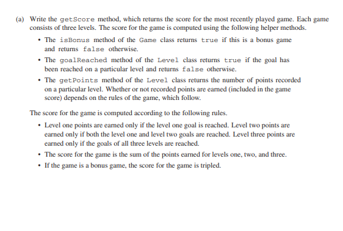
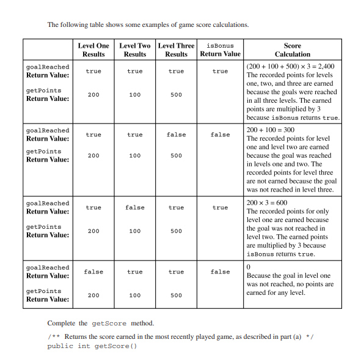

## Definition:
> An Array is a collection of items of the same type, stored in sequence at memory locations.
> An Array is used to store data and is used in almost every programming language out there.
> In Java, an Arraylist is an Array that can be modified and they are more flexible and versatile.

## Examples:

## FRQ Question:

## Explaination:
> First, We must read the question and understand what it is telling us.
> Next, We figure out the solution via coding:
